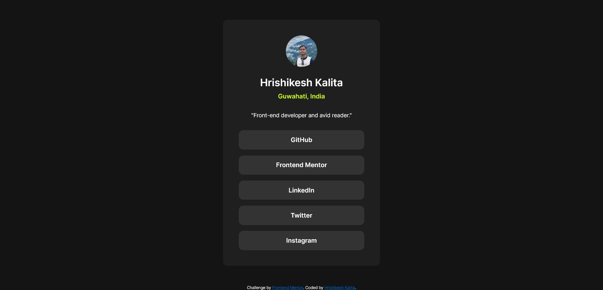

# Frontend Mentor - Social links profile solution

This is a solution to the [Social links profile challenge on Frontend Mentor](https://www.frontendmentor.io/challenges/social-links-profile-UG32l9m6dQ). Frontend Mentor challenges help you improve your coding skills by building realistic projects. 

Also, I didn't get any figma or any other design file to accurately match the original design, and for my one, I tried my best to calculate the sizes of the elements by analyzing them with my naked eye.

## Table of contents

- [Frontend Mentor - Social links profile solution](#frontend-mentor---social-links-profile-solution)
  - [Table of contents](#table-of-contents)
  - [Overview](#overview)
    - [Screenshot](#screenshot)
    - [Links](#links)
  - [My process](#my-process)
    - [Built with](#built-with)
    - [What I learned](#what-i-learned)
  - [Author](#author)

**Note: Delete this note and update the table of contents based on what sections you keep.**

## Overview

### Screenshot

### Links

- Live Site URL: [https://hrishid89.github.io/Social-links-profile/](https://hrishid89.github.io/Social-links-profile/)

## My process

### Built with

- Semantic HTML5 markup
- CSS custom properties
- Flexbox
- Mobile-first workflow

### What I learned

This project help me recap html and css concepts and helped me get a hand on practice after a long break and i plan to complete frontend mentors all other challenges to get a good practice.

## Author

- X - [@hrishiiiii__](https://x.com/hrishiiiii__)
- LinkedIN - [@hrishikesh-kalita-854000207](https://www.linkedin.com/in/hrishikesh-kalita-854000207/)
- Frontend Mentor - [@HrishiD89](https://www.frontendmentor.io/profile/HrishiD89)

